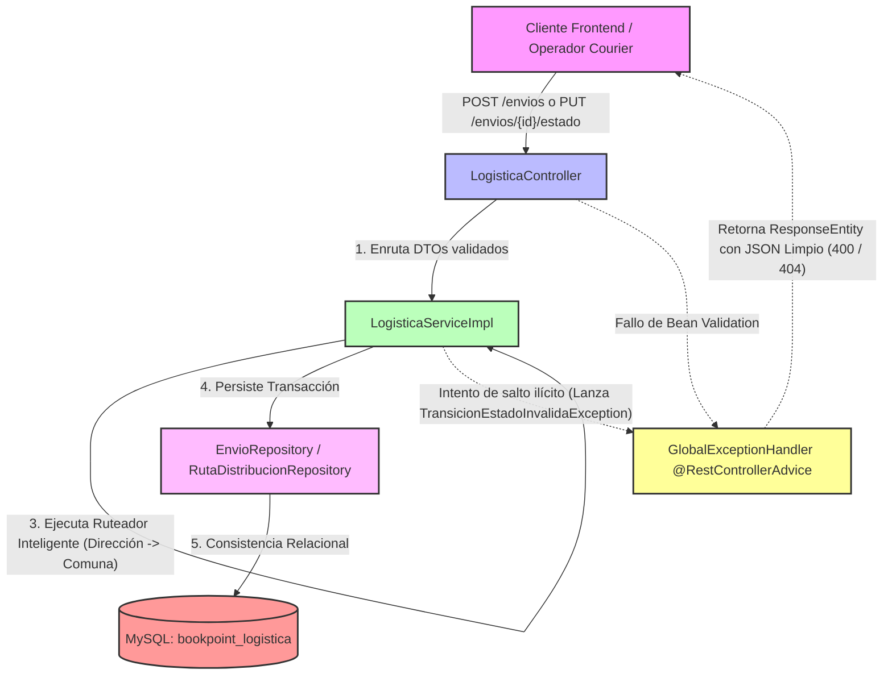

# Microservicio ms-logistica - BookPoint Chile
> **Área:** Despacho, Seguimiento a Domicilio y Enrutamiento Inteligente  
> **Arquitectura:** Microservicios con Spring Boot (Java 17) bajo Patrón CSR  
> **Puerto por Defecto:** `8085`

---

## 1. Visión General y Responsabilidades

El microservicio **`ms-logistica`** gestiona la última fase operativa de las adquisiciones online de **BookPoint Chile**. Es el encargado de centralizar y automatizar los despachos a domicilio, coordinar la relación de cargas con empresas de transporte (couriers) y asegurar que el cliente web e internos puedan rastrear la transición física de sus paquetes en tiempo real.

### Reglas de Negocio Críticas Controladas en la Capa Service:
*   **Máquina de Estados Logística Estricta:** Un paquete no puede saltarse pasos en su flujo de entrega. Las transiciones válidas son:
    *   `PENDIENTE` ➔ `EN_RUTA` (Única transición permitida en fase inicial).
    *   `EN_RUTA` ➔ `ENTREGADO` o `DEVUELTO` (Fase de resolución final).
    *   Los estados `ENTREGADO` y `DEVUELTO` son terminales e inmutables. Cualquier salto prohibido (ej. PENDIENTE ➔ ENTREGADO) se bloquea en la capa de servicios.
*   **Enrutador Geográfico Inteligente:** Si en la solicitud de despacho se omite el `rutaId`, el motor analiza sintácticamente la dirección de destino. Si detecta la cadena **"Hualpén"** o **"Talcahuano"**, asocia de forma dinámica la ruta optimizada que parte desde la **Bodega Central Concepción** asignando de forma automática al Courier correspondiente.
*   **Índice de Unicidad de Venta:** Para prevenir despachos duplicados causados por latencias del cliente, se fuerza una única boleta de despacho activa por cada ID de venta (`venta_id`).

---

## 2. Diagrama de Estructura y Máquina de Estados (Mermaid)

El siguiente diagrama ilustra la arquitectura bajo el patrón CSR, destacando la lógica de transición validada en el servicio y la intercepción de errores mediante el gestor global:



---

## 3. Tecnologías Core e Implementación Técnica

*   **Spring Boot 3.2.5:** Framework principal del ecosistema del microservicio.
*   **Spring Data JPA (Hibernate):** Persistencia relacional. Implementa una asociación `@ManyToOne(fetch = FetchType.EAGER)` desde `Envio` hacia `RutaDistribucion` para consolidar inmediatamente los datos del transportista y destino en las consultas del cliente.
*   **Garantía de Unicidad Física:** Fuerte consistencia mediante `@UniqueConstraint(name = "uk_envio_venta", columnNames = "venta_id")` en la tabla `envios` para evitar despachos duplicados sobre una boleta financiera.
*   **JSR 380 (Bean Validation 3.0):** Emplea anotaciones en `CrearEnvioRequestDTO` y `ActualizarEstadoRequestDTO` para proteger la entrada de datos:
    *   `@NotBlank` en direcciones destino para evitar inconsistencias de despacho.
    *   `@NotNull` en estados e identificadores de venta.
*   **SLF4J (Logback):** Integrado nativamente mediante `@Slf4j` en el `Service` para registrar el despacho de paquetes (`log.info`) y emitir alertas críticas (`log.warn`) ante intentos de saltarse la máquina de estados.

---

## 4. Documentación de Endpoints REST

La API REST cuenta con soporte total de CORS habilitado (`@CrossOrigin`) para integraciones directas bajo el patrón CSR:

| Método HTTP | Endpoint | Descripción | Códigos HTTP de Respuesta |
| :--- | :--- | :--- | :--- |
| **POST** | `/api/logistica/envios` | Registra una nueva solicitud de despacho. Activa el enrutador inteligente para asociar el courier correspondiente si se omite la ruta. | `201 Created` (Éxito)<br>`400 Bad Request` (Venta duplicada, campos vacíos)<br>`404 Not Found` (Ruta manual no existe) |
| **PUT** | `/api/logistica/envios/{id}/estado` | Modifica el estado del envío. Fuerza el cumplimiento estricto de la máquina de estados del negocio. | `200 OK` (Éxito)<br>`400 Bad Request` (Salto ilícito de estado)<br>`404 Not Found` (ID de envío no existe) |
| **GET** | `/api/logistica/envios/venta/{ventaId}` | Permite recuperar el estado y los datos del transportista a través del identificador de la venta. | `200 OK` (Éxito)<br>`404 Not Found` (Venta no tiene despacho asociado) |

---

## 5. Pruebas de Integración (Postman)

### ✅ Happy Path: Creación Automática de Envío con Ruteo Comunal Inteligente
*   **Método:** `POST`
*   **URL:** `http://localhost:8085/api/logistica/envios`
*   **Body (JSON Raw):**
```json
{
  "ventaId": 5005,
  "direccionDestino": "Calle Los Alerces 452, Hualpén, Región del Bío Bío"
}
```
*   **Efecto:** El sistema comprueba que no exista despacho para la venta `5005`. Al analizar el destino y mapear la subcadena **"Hualpén"**, asocia dinámicamente la ruta física de la comuna de Hualpén y le asigna el courier **"Courier BíoBío - Zona A"**, retornando un código **201 Created**.

---

### ❌ Flujo de Error: Intento de Salto Ilícito de Estado (PENDIENTE ➔ ENTREGADO)
*   **Método:** `PUT`
*   **URL:** `http://localhost:8085/api/logistica/envios/1/estado`
*   **Body (JSON Raw):**
```json
{
  "estado": "ENTREGADO"
}
```
*   **Efecto:** El despacho con ID `1` fue sembrado como `PENDIENTE`. El servicio intercepta la petición y detecta que se está intentando saltar el estado intermedio obligatorio (`EN_RUTA`). Aborta la transacción, genera un `log.warn` en consola y el `@RestControllerAdvice` (`GlobalExceptionHandler`) responde con **HTTP 400 Bad Request** y el siguiente JSON estructurado:

```json
{
  "timestamp": "2026-05-24T18:29:10.123456",
  "status": 400,
  "error": "Bad Request - Logistical Rule Violation",
  "message": "Transición inválida. Un envío PENDIENTE solo puede pasar a estado EN_RUTA.",
  "path": "/api/logistica/envios/1/estado",
  "details": null
}
```

---

## 6. Instructions de Ejecución

### Requisitos Previos:
1.  **Java JDK 17** en tu entorno.
2.  **Apache Maven 3.8+** instalado.
3.  **MySQL Server** configurado y en ejecución.

### Configuración del Entorno:
1.  Crea la base de datos `bookpoint_logistica` en tu MySQL local:
    ```sql
    CREATE DATABASE bookpoint_logistica;
    ```
2.  Configura las credenciales en el archivo [application.properties](src/main/resources/application.properties):
    ```properties
    spring.datasource.url=jdbc:mysql://localhost:3306/bookpoint_logistica?createDatabaseIfNotExist=true&useSSL=false&serverTimezone=UTC
    spring.datasource.username=root
    spring.datasource.password=tu_contraseña
    ```

### Sembrado Automático de Datos de Prueba (Boot Seeder):
El microservicio incorpora un sembrador inteligente `DataInitializer.java` que se ejecuta al arrancar. Si detecta la base de datos vacía, insertará automáticamente:
*   Las rutas optimizadas (Concepción -> Hualpén, Concepción -> Talcahuano, Concepción -> Región Bío Bío) asociando sus respectivos couriers.
*   Tres envíos de prueba en distintos estados (PENDIENTE en Hualpén, EN_RUTA en Talcahuano y ENTREGADO en Concepción) para verificar las validaciones y endpoints de manera inmediata.

### Ejecutar el Microservicio:
Abre una terminal en la raíz de `ms-logistica`  y ejecuta:

```bash
mvn clean spring-boot:run
```

El servicio iniciará en el puerto **`8085`**, listo para coordinar y monitorear los despachos de la librería.
